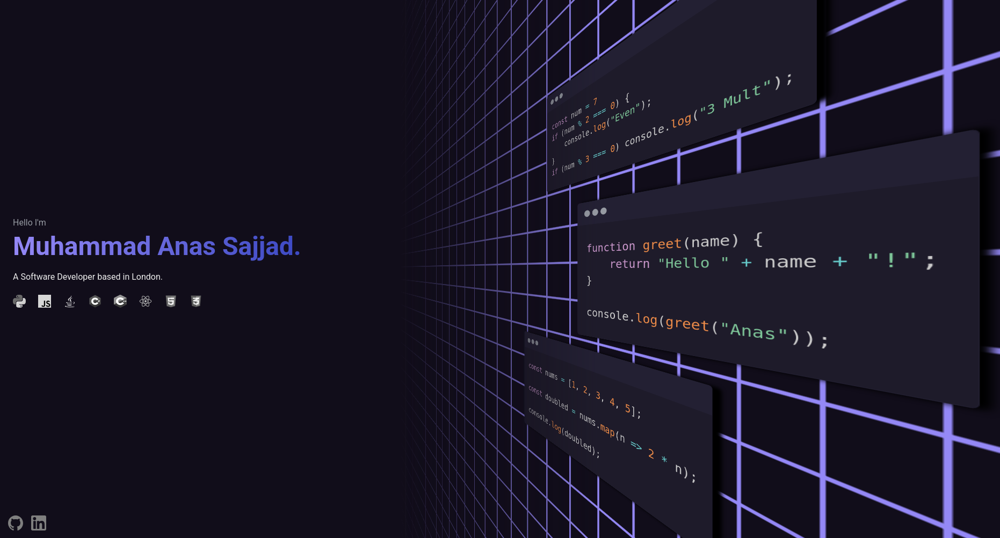

<div align="center">
  <h1>Muhammad Anas Sajjad - Portfolio</h1>
  <p>
    <a href="https://muhammadanasajjad.github.io/portfolio/">Live Site</a>
    ·
    <a href="https://github.com/muhammadanasajjad/portfolio/issues">Report Bug</a>
  </p>
  <p>
    
    
    
  </p>
</div>

---

Personal portfolio for **Muhammad Anas Sajjad**, a Software Developer based in London. Built with vanilla HTML/CSS — no frameworks, no JavaScript libraries.



## Table of Contents

- [Pages](#pages)
- [Tech Stack](#tech-stack)
- [Getting Started](#getting-started)
- [Color Reference](#color-reference)
- [Structure](#structure)

## Pages

### Landing (`html/main.html`)
Hero section, 8 skill badges with hover reveals, 3D code windows with syntax-highlighted JavaScript, GitHub/LinkedIn links, and a preview of 3 featured projects.

### Works (`html/works.html`)
6 project cards:

| Project | Stack |
|---------|-------|
| **SilentTalk** | React, JS |
| **Al Falah** | React Native, Expo, JS |
| **Digital Logic Simulator** | HTML, CSS, JS |
| **Javish Interpreter** | HTML, CSS, JS |
| **NEAT AI** | Java |
| **Bus Router** | Java |

## Tech Stack

| What | How |
|------|-----|
| HTML5 | 2 pages, semantic markup |
| CSS3 | Variables, 3D transforms, animations, responsive |
| PrismJS | Syntax highlighting |
| Python + livereload | Dev server with hot-reload |
| Google Fonts | Roboto Variable + Material Symbols Rounded |

## Getting Started

```bash
# clone
git clone https://github.com/muhammadanasajjad/portfolio.git
cd portfolio

# start dev server (requires livereload)
python3 server.py    # or ./serve.sh
```

Open `http://localhost:8000` — livereload watches html/css/js for changes.

## Structure

```
portfolio/
├── css/
│   ├── global.css    # variables, base, button
│   ├── main.css      # landing page
│   └── works.css     # works page
├── html/
│   ├── main.html
│   └── works.html
├── img/              # screenshots + tech logos
├── libs/
│   ├── prism.js
│   └── prism-tomorrow.css
├── js/
├── server.py
└── serve.sh
```
